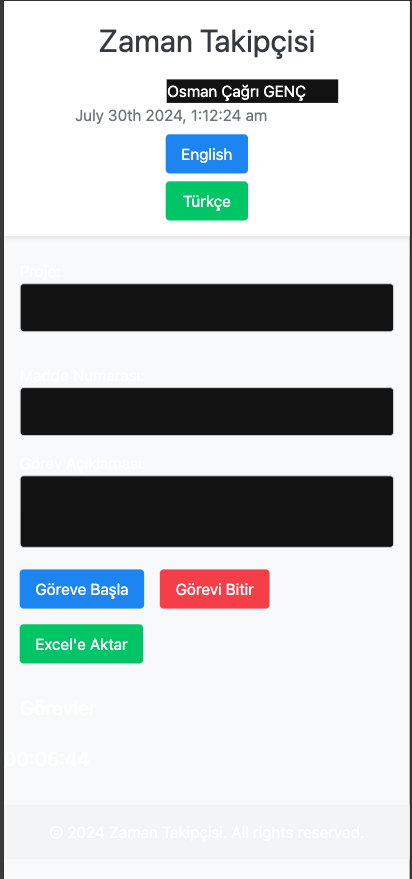
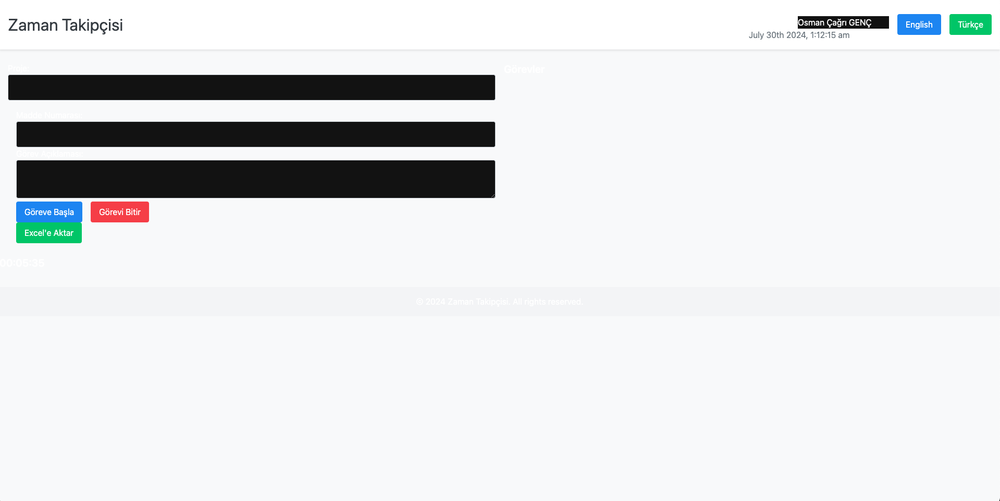

```markdown
# Employee Time Tracker

Bu proje, çalışanların günlük aktivitelerini kaydetmelerini ve gün sonunda bu aktiviteleri Excel formatında raporlamalarını sağlayan bir uygulamadır. Uygulama modern bir tasarıma sahiptir ve responsive (duyarlı) bir şekilde çalışmaktadır.

## Özellikler

- Çalışan adı ve soyadı girişi
- Proje ve madde numarası seçimi veya girişi
- Görev açıklaması yazımı
- Başla ve Bitir butonları ile zaman takip fonksiyonu
- Geçen sürenin canlı olarak gösterimi
- Görevlerin listelenmesi
- Görevlerin Excel formatında dışa aktarımı
- Çoklu dil desteği (İngilizce ve Türkçe)

## Kullanılan Teknolojiler

- **Next.js**: React tabanlı bir framework olup, sunucu tarafı rendering (SSR) ve static site generation (SSG) gibi özellikleri destekler.
- **React**: Kullanıcı arayüzü oluşturmak için kullanılan JavaScript kütüphanesi.
- **Tailwind CSS**: Hızlı ve duyarlı stil oluşturmak için kullanılan bir CSS frameworkü.
- **moment.js**: Tarih ve zaman işlemleri için kullanılan bir kütüphane.
- **xlsx**: Excel dosyalarını oluşturmak ve yönetmek için kullanılan bir kütüphane.
- **next-i18next**: Next.js ile uluslararasılaştırma (i18n) ve yerelleştirme (l10n) sağlamak için kullanılan bir kütüphane.
- **i18next**: Uluslararasılaştırma ve yerelleştirme için kullanılan bir JavaScript kütüphanesi.

## Kurulum ve Çalıştırma

Projenin yerel ortamda çalıştırılması için aşağıdaki adımları izleyin:

### Gerekli Bağımlılıkların Kurulması

```bash
npm install
```

### Geliştirme Ortamında Çalıştırma

```bash
npm run dev
```

### Üretim Ortamı için Derleme

```bash
npm run build
npm start
```

## Kullanım

### Başla ve Bitir Butonları

- **Başla** butonuna tıklayarak zaman takip işlemini başlatabilirsiniz.
- **Bitir** butonuna tıklayarak zaman takip işlemini durdurabilir ve geçen süreyi kaydedebilirsiniz.

### Excel'e Aktarma

- Görevlerinizi tamamladıktan sonra **Excel'e Aktar** butonuna tıklayarak tüm görevlerinizi Excel dosyası olarak dışa aktarabilirsiniz.

## Dil Değiştirme

- Sayfanın üst kısmında bulunan dil değiştirme butonlarını kullanarak uygulamanın dilini İngilizce veya Türkçe olarak değiştirebilirsiniz.

## Ekran Görüntüleri

### Mobil Görünüm


### Masaüstü Görünüm


## Katkıda Bulunma

Katkıda bulunmak isterseniz, lütfen bir pull request oluşturun veya bir issue açın. Katkılarınızı bekliyoruz!

## Lisans

Bu proje MIT Lisansı altında lisanslanmıştır. Daha fazla bilgi için `LICENSE` dosyasına bakınız.